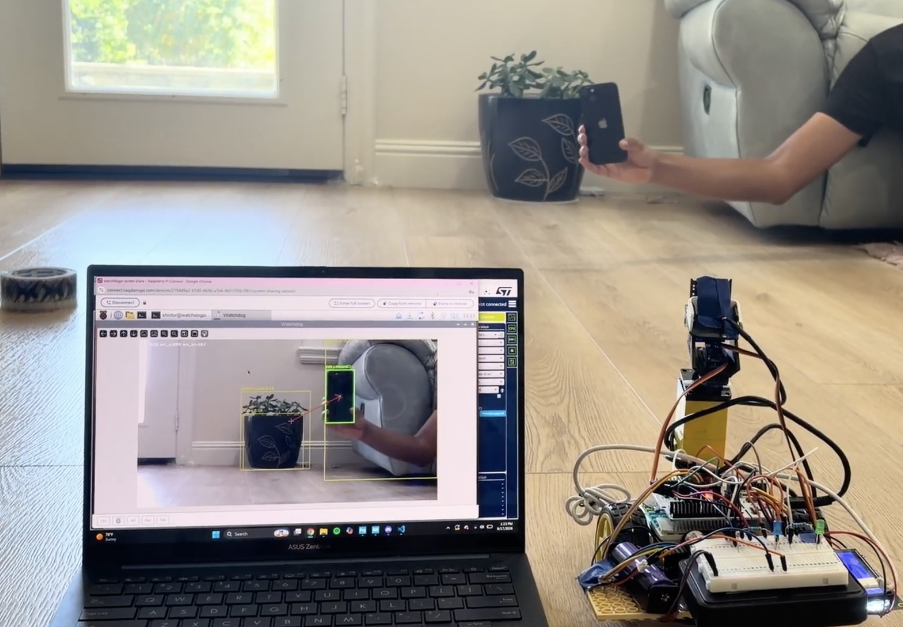

# Watchdog
<p align="center">
  
</p>

</p>
> **Status: under active development.** 

## Overview

Watchdog is a pan-tilt camera system that finds and tracks a
user-specified object. The user tells it what to look for (and optionally
a visual attribute like color), the system detects candidates with YOLO,
picks the best match, and tracks it — computing how far the target is from
the center of the camera frame so that error can eventually drive pan/tilt
servos on an STM32.

Example interaction (target behavior):

```
What would you like to find?
> cat

What color?
> orange

Searching for: orange cat
```

Longer-term, natural-language commands such as "Find the orange cat" or
"Track the person wearing a blue shirt" are planned as well.

## Current Status

Detection, color matching, target selection and tracking are implemented and
run end-to-end. The serial link is almost entirely set up. Work is currently
on the hardware side, waiting on parts before a demo can go up.

## System Architecture

Planned high-level flow:

```
User input (CLI) -> command parsing -> YOLO detection -> attribute matching
   -> target selection -> tracking -> center error -> serial link -> STM32
```

### Vision Pipeline

- Capture frames from a camera (`vision/camera.py`)
- Detect candidate objects with YOLO (`vision/detector.py`)
- Score candidates against a requested attribute like color
  (`vision/color_matcher.py`)
- Select the best-matching target (`vision/target_selector.py`)
- Track the target across frames and compute center error
  (`vision/tracker.py`)
- Estimate distance to the target (`vision/distance_estimation.py`)

### Hardware

- Pan-tilt camera mount
- STM32 microcontroller for servo control (planned)
- IMU for stabilization (planned)

### Software

- Python vision pipeline (OpenCV, NumPy, Ultralytics YOLO)
- CLI for interactive object/attribute selection
- Serial protocol for host-to-STM32 communication

## Build Stages

1. Project scaffolding (this stage)
2. CLI + command parsing
3. YOLO-based object detection
4. Color/attribute matching and target selection
5. Tracking and center-error computation
6. Serial communication with STM32
7. STM32 firmware for pan/tilt servo control
8. IMU-based stabilization and distance estimation

## Validation Metrics

Vision behaviour is measured on simulated runs (a moving target, a detector
that drops frames and jitters its boxes, and a second object of the same
class nearby), scored as the share of frames holding a lock on the correct
object. Mean of 8 runs x 300 frames:

| Scenario                          | Correct lock |
|-----------------------------------|--------------|
| bottle, slow, no color requested   | 99.9%        |
| bottle, fast, no color requested   | 98.5%        |
| bottle, slow, color requested      | 95.5%        |
| bottle, fast, color requested      | 94.7%        |
| bottle, slow, 40% detector dropout | 88.2%        |
| bottle, fast, 40% detector dropout | 78.7%        |
| person, slow                       | 100.0%       |
| person, fast                       | 99.6%        |

"Fast" is 140 px per frame, roughly a hand-carried object at 12 fps on a
1280x720 feed.

Three things had made small objects track far worse than people:

- The tracker's search gate was a multiple of the target's *own* size, so a
  500 px person was allowed 500 px of movement per frame and a 110 px bottle
  only 110 px. Identical motion was followed for one and dropped for the
  other. The gate now has a floor tied to the frame, follows the target's
  predicted position, and opens along its velocity while it is missing.
- Color matching required a pixel to clear a saturation floor of 100 while
  counting it as a candidate from 50, so ordinary indoor colors scored a flat
  0.00 and a color request could never be satisfied. Pixels are now
  classified into whichever color explains them best, which also closes the
  gaps and overlaps the old ranges left.
- Selection refused to lock below 0.50 confidence while the detector emitted
  from 0.25, and small objects land in between -- so a bottle at 0.42 was
  drawn on screen every frame and never locked onto.

## Demo

<p align="center">
  
</p>

The Pi streams its camera feed and detection overlay to a laptop over
Raspberry Pi Connect while the rover tracks a hand-held phone target,
drawing a bounding box and a line from frame center to target center to
visualize tracking error. More screenshots and video will be added to
`docs/demo/` as the project progresses.

## Repository Structure

```
Watchdog_car/
├── vision/                # Detection, color matching, target selection, tracking
├── interface/              # CLI and command parsing
├── communication/          # Host <-> STM32 serial protocol
├── firmware/               # STM32 firmware (planned)
├── calibration/            # HSV tuning and camera calibration tools
├── data/                   # Logs and measurements
├── tests/                  # Unit tests
├── docs/                   # Diagrams, screenshots, demo assets
├── scripts/                # Entry point script(s)
├── requirements.txt
├── .gitignore
└── LICENSE
```
